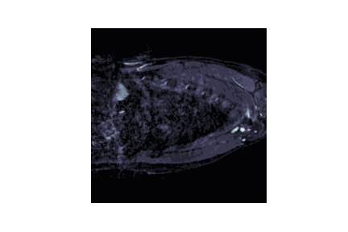

# Medical-Image-Segmentation-Atrium
Constructing UNET and FCN8 models for left atrium segmentation

### Project Summary:
My Goal is to create two image segmentation models that can identify the left atrium segmentation from MRI scans. These models are Fully Convolutional Network (FCN-8) and UNET. 
The accuracy of the model will be measured using the binary_crossentropy loss and both predicted results will be compiled to GIFs.  
**Side Note:** Model structures are learned from Coursera Course, Advanced Techniques TensorFlow

### Data Source:
Source: http://medicaldecathlon.com/  
License: https://creativecommons.org/licenses/by-sa/4.0/

### Project Steps:
#### Step 1 
Extract mri and segmentation labels using nibabel.  
#### Step 2 
Covert extractednumpy arrays to TF-Records, a data format that is believed to be the best for training when using TensorFlow Keras  
Additionally, this format saves a lot of storage space on your PC :D! (70~80% storage savings)
#### Step 3
Build models, FCN-8 and UNET with  
Final Output Layer: "Sigmoid"  
Loss: "Binary CrossEntropy" 
Optimizer: "Adam" 
**Side Note:** These structures can also be used for multi-class segmentation problem but changes need to apply accordingly

### Results:
#### Ground Truth:

#### FCN-8 Predicted Result:

#### UNET Predicted Result:

